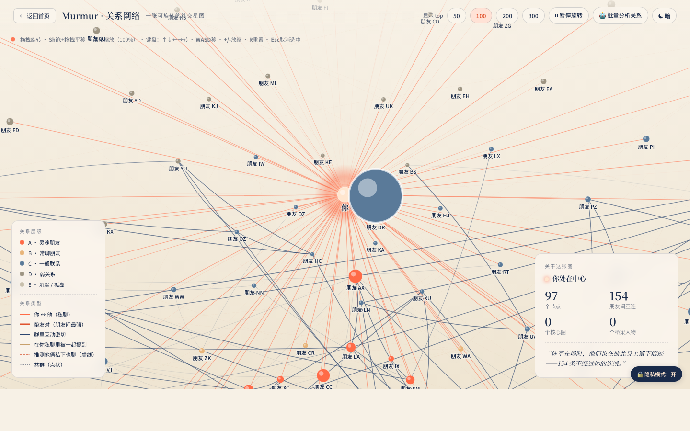
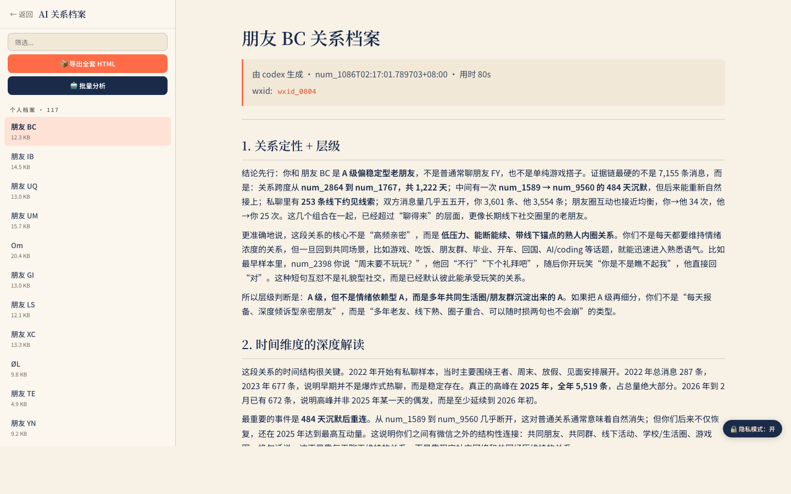

# Murmur 微语

把你的微信聊天记录变成一张本地关系地图：谁和你最熟、谁和谁经常一起出现、哪些关系已经淡了、哪些群聊和朋友圈暗暗串起了你的社交网络。

Murmur 默认只在本机读取和分析数据。只有你主动点击 AI 分析时，才会把整理后的样本交给你本机已登录的 Claude Code 或 Codex CLI。

[下载最新版](https://github.com/sgaofen/murmur/releases/latest)

当前推荐版本：`v0.2.15`


## 视频教程

- [Mac 安装视频](https://github.com/sgaofen/murmur/releases/download/v0.2.15/Murmur_macOS_install_tutorial.mp4)
- [Windows 安装视频](https://github.com/sgaofen/murmur/releases/download/v0.2.15/Murmur_Windows_install_tutorial.mp4)

## 能做什么

- 自动读取本机微信数据，生成朋友、群聊、时间线和活跃度概览。
- 画出可旋转的关系网络，区分私聊、朋友间互动、共同群聊、朋友圈交叉痕迹。
- 点击人物看完整关系档案，点击连线看两个人之间的关系推断。
- 用 Claude Code 或 Codex CLI 批量生成 AI 关系分析报告。
- 一键开启隐私模式，公开截图和录屏时自动隐藏姓名、wxid、本机路径和敏感片段。






## 下载哪个文件

Windows 用户：

- 推荐下载：`Murmur_0.2.15_x64-setup.exe`
- 不推荐普通用户下载：`Murmur_0.2.15_x64_en-US.msi`

Mac 用户：

- Apple Silicon Mac 下载：`Murmur_macOS_AppleSilicon.dmg`
- 备用排错文件：`Murmur_macOS_AppleSilicon.app.zip`

Intel Mac 暂时没有安装包，需要从源码运行。

## Windows 安装

1. 下载 `Murmur_0.2.15_x64-setup.exe`。
2. 双击安装。
3. 打开微信，退出到登录页，但不要关闭微信程序。
4. 打开 Murmur，按引导点击「开始抓密钥」。
5. 看到等待登录事件后，回微信扫码或自动登录一次。
6. 抓到 key 后会自动解密，然后进入主界面。

如果提示杀毒软件拦截 `wx_key.dll`，把 Murmur 安装目录加入杀毒软件白名单，然后重新安装再试。

## Mac 安装

1. 下载 `Murmur_macOS_AppleSilicon.dmg`。
2. 双击打开 dmg。
3. 把里面的 `Murmur.app` 拖到「应用程序」。
4. 不要直接在 dmg 窗口里运行。
5. 从「应用程序」里打开 Murmur。

如果 macOS 提示无法打开：

1. 先点「完成 / Done」，不要点「移到废纸篓」。
2. 打开「系统设置」。
3. 进入「隐私与安全性」。
4. 滚到底部，点击「仍要打开 / Open Anyway」。
5. 再次打开 Murmur。

如果没有「仍要打开」，打开 Terminal，运行：

```bash
xattr -dr com.apple.quarantine /Applications/Murmur.app
open /Applications/Murmur.app
```

首次使用 Mac 版时，Murmur 会继续引导你：

1. 给 Murmur「完全磁盘访问」权限。
2. 重启 Murmur。
3. 按按钮给 WeChat 重签名。
4. 回 WeChat 点开 3-5 个私聊，再翻一下朋友圈。
5. 回 Murmur 点「开始自动抓取」。
6. 等待解密完成后进入主界面。

## AI 分析

Murmur 会先把私聊、群聊、朋友圈线索和朋友间共同出现的证据整理成分析包，再交给 Claude Code 或 Codex CLI。

你可以在「报告」页选择：

- 小样本自检
- Top 朋友和 Top 关系
- 全部朋友 + 朋友间关系
- 只补朋友间关系报告

报告默认储存在：

```text
~/Desktop/Murmur/agent_reports/
```

## 隐私模式

右下角点击「隐私模式」即可切换。隐私模式会隐藏：

- 好友昵称和群名
- wxid、chatroom id
- 本机路径
- 邮箱、手机号样式文本
- key 样式的 64 位十六进制字符串

## 遇到问题

Windows 优先下载 `.exe` 安装包。Mac 目前没有付费 Apple 公证，所以第一次打开需要按上面的安全设置步骤放行。

如果后端启动失败、解密失败或抓 key 失败，Murmur 会把日志放在：

```text
~/Documents/Murmur/logs/
```
