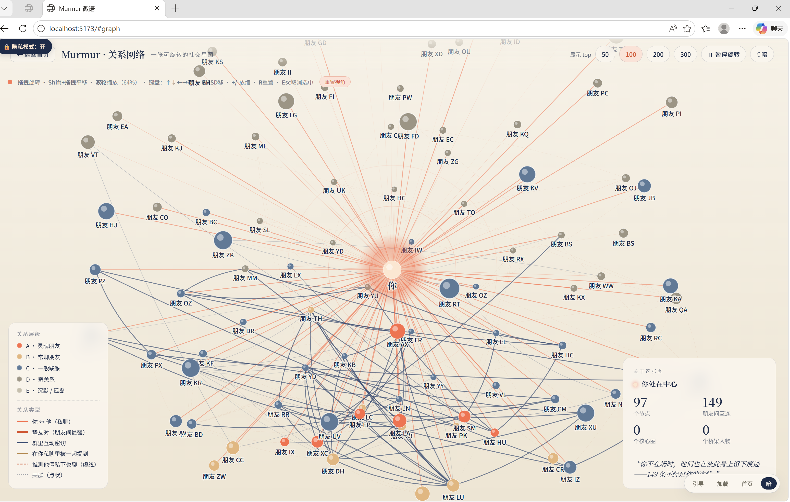
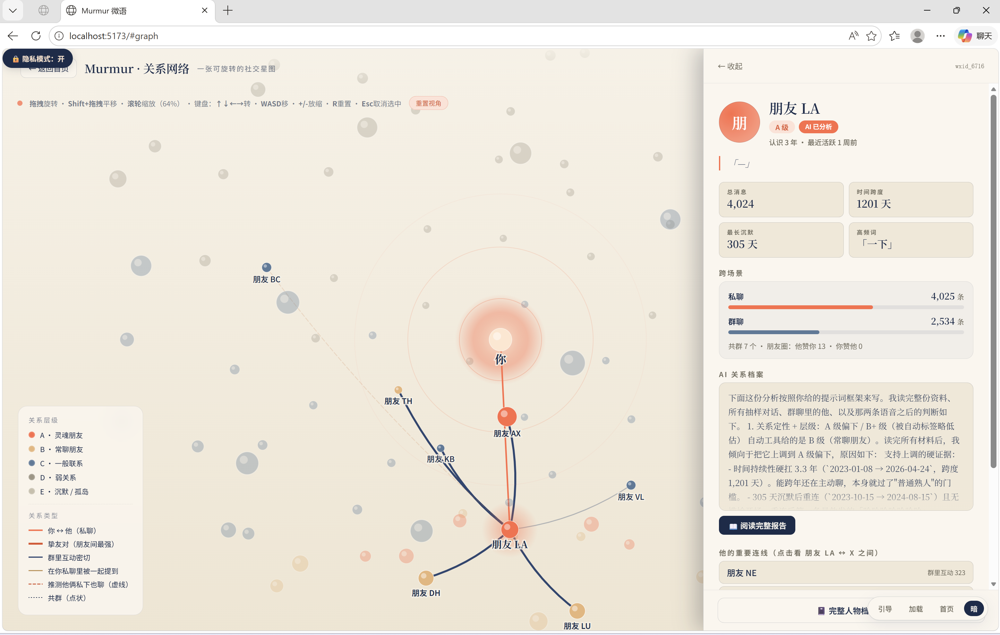
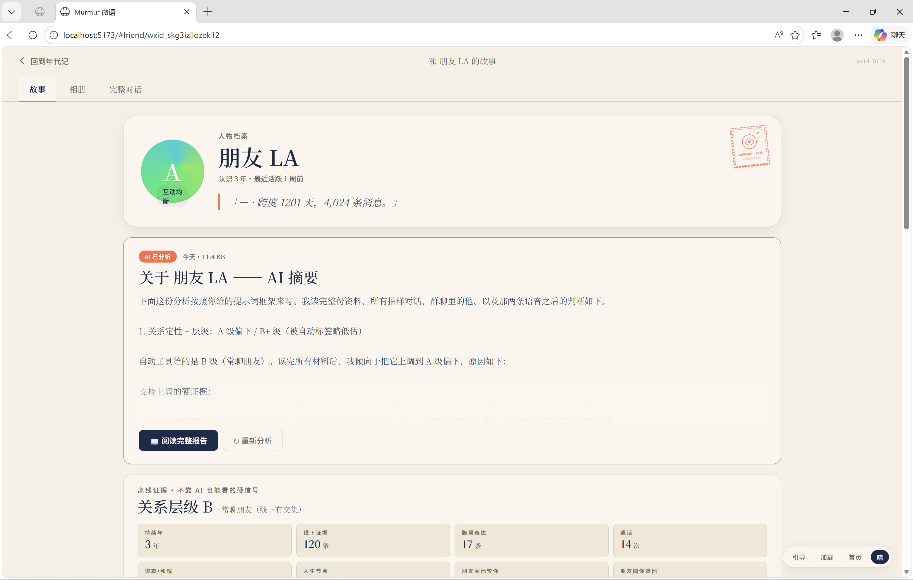
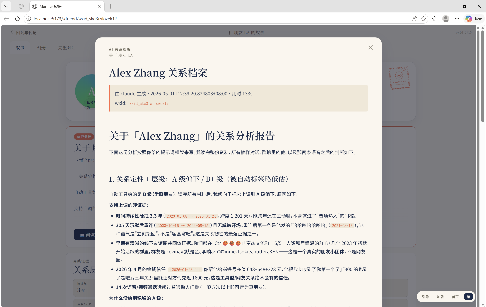

# Murmur 微语 · 你的微信社交故事

> **100% 本地** · 不上传任何东西 · 把你这些年的微信聊天，变成一本可读、可分析、可分享的关系档案

[]()
[](LICENSE)
[](https://github.com/sgaofen/murmur/releases)


*所有截图都开了「🔒 隐私模式」—— 真实使用时显示真名。*

---

## 它能做什么

把你已登录的微信里几年的聊天记录变成 **三种东西**：

1. **关系网络** — 你和所有联系人 + 朋友与朋友之间的真实互动（私聊、群聊互动、朋友圈点赞评论），3D 可旋转可点击
2. **离线信号矩阵** — 不靠 AI，纯本地统计就能告诉你：哪些是 4 年老朋友、谁和你互相关心、谁单方面关心你、谁正在淡出
3. **AI 关系档案**（可选）— 接入你本地的 [Claude Code](https://github.com/anthropics/claude-code) 或 [Codex CLI](https://github.com/openai/codex)，让它读你的对话样本（最多 80 条 / 朋友），输出一份结构化的关系深度分析（包含：关系层级、时间维度、线下证据、信任与情感深度、人物画像、关系走向）

**核心特性**：
- 🔒 数据从微信读出，分析在你电脑上完成 —— **不联网、不上传、不打点**
- 📊 100 个朋友 × 6 个维度的关系信号矩阵，所有数据可导出 CSV
- 🤖 可选 AI 分析（你自己用 OpenAI 或 Anthropic 账号），不接 AI 也完全可用
- 🎙️ Whisper 转写语音消息（已有 echotrace 提取的 mp3 → 文字 → AI 分析时一并喂入）
- 🌌 3D 关系图，按朋友圈/群聊/私聊互动权重分布
- 📓 双人年代记 —— Spotify-Wrapped 风格，按年份回顾
- 📦 一键导出全套 HTML，离线分享

---

## 快速开始

### 下载安装包（推荐）

去 [Releases](https://github.com/sgaofen/murmur/releases) 下载最新版：

- **Windows**: `Murmur_x.x.x_x64-setup.exe` 或 `Murmur_x.x.x_x64_en-US.msi`
- **macOS**: `Murmur_x.x.x_aarch64.dmg`（M 系列芯片）/ `Murmur_x.x.x_x64.dmg`（Intel）

双击安装，按引导走完即可。

### 从源码运行（开发模式）

```bash
git clone https://github.com/sgaofen/murmur.git
cd murmur

# Windows
./start-windows.bat

# macOS / Linux
./start-mac.sh
```

需要：Python 3.11+ 、 Node.js 18+ 。第一次会自动 `pip install -r requirements.txt` + `npm install`。

---

## 它是怎么工作的

```
┌───────────────────────────────────────────────────────────────┐
│  1. 微信本地数据 (xwechat_files/)                             │
│     - 加密 SQLite (SQLCipher v4 / 4096-byte 页 / AES-256-CBC) │
│     - 加密 .dat 图片 / silk 语音 / 朋友圈 XML                 │
└────────────────────────┬──────────────────────────────────────┘
                         │
                ▼ 抓内存 key (一次)
                         │
                         ▼
┌───────────────────────────────────────────────────────────────┐
│  2. wx_key.dll 扫 Weixin.exe 内存找 32-byte hex key          │
│     go_decrypt.dll / 纯 Python decrypt_py.py 解密所有 .db    │
└────────────────────────┬──────────────────────────────────────┘
                         │
                         ▼
┌───────────────────────────────────────────────────────────────┐
│  3. 解密后的本地 SQLite                                       │
│     contact.db / session.db / message_*.db / sns.db          │
└────────────────────────┬──────────────────────────────────────┘
                         │
                         ▼
┌───────────────────────────────────────────────────────────────┐
│  4. etcli serve (Python HTTP API on localhost:9100)          │
│     - 关系图构建 (mutual_reply / mention / co_group / sns)   │
│     - 离线信号矩阵 (signature_notes 时间线/频率)             │
│     - 朋友圈互动解析 (从 SnsTimeLine XML 抽 like/comment 列表)│
│     - AI 分析包 (build_analysis_pack / build_pair_pack)      │
│     - 调本地 claude/codex CLI （fire-and-poll，流式）        │
└────────────────────────┬──────────────────────────────────────┘
                         │
                         ▼
┌───────────────────────────────────────────────────────────────┐
│  5. Tauri shell + React frontend                              │
│     - 主页 / 朋友档案 / 双人年代记 / 关系图 / 报告           │
└───────────────────────────────────────────────────────────────┘
```

### 核心算法

- **WCDB v4 解密**：`PBKDF2-HMAC-SHA512` 256000 轮 → AES-256-CBC，每页 4096 字节包含 16 字节 IV + 64 字节 HMAC reserve
- **群聊真互动检测**：5 分钟滑窗内 A 回复 B（不同发送者），按群人数对数衰减以避免大群噪音
- **朋友圈交叉互动**：解析 `SnsTimeLine.content` 里的 `<LocalExtraInfo>/<like_user_list>` 和 `<comment_user_list>`，找 A↔B 互动（不经你）
- **朋友间提及**：私聊中按显示名匹配其他朋友（带 EXCLUDE 黑名单避免误伤）
- **AI prompt**：强制要求每个结论引用具体消息（带日期）或统计数字，不接受空洞形容词

---

## 截图

### 关系网络（隐私模式开启）

97 个真实朋友 / 149 条边，按互动权重分布。每个节点点开能看到详情面板。


### 选中朋友 → 查看跨场景画像 + 重要连线



### 朋友档案：AI 摘要 + 离线证据卡

不接 AI 也能用：层级、持续年、线下证据条数、朋友圈双向、深夜比、通话次数 全离线统计。
接了 AI 多一份精装关系档案。



### AI 关系档案（claude 或 codex 写）

强制要求每个结论引用具体消息或统计 —— 不接受空洞形容词。



---

## 文档

- [Windows 上手](docs/ONBOARDING_WINDOWS.md)
- [macOS 上手](docs/ONBOARDING_MAC.md)
- [隐私 & 安全](docs/PRIVACY.md)
- [架构 & 开发](docs/ARCHITECTURE.md)

---

## FAQ

**Q: 微信会被封吗？**
不会。Murmur 不调用任何微信 API、不模拟登录、不发消息。它只是从你电脑上的本地数据库读出聊天记录。

**Q: 用了 AI 会上传我的聊天吗？**
取决于你用的 AI 是哪家：
- **Claude Code** / **Codex CLI** — 你在终端里跑这俩工具时，prompt 会上传到 Anthropic / OpenAI 服务器（这是它们的常规行为，跟 Murmur 无关）
- **不接 AI** — 离线信号矩阵 + 关系图 全本地，零联网

**Q: 数据会被存到云端吗？**
不会。所有产物都在你 `~/Documents/Murmur/` 和 `~/Desktop/Murmur/agent_reports/`，删了就没了。

**Q: 支持微信 4.x 吗？3.x 呢？**
4.x 完整支持。3.x 不支持（数据库格式不同）。

**Q: 我没装 Python / Node 也能用吗？**
不用装。Win 安装包已用 PyInstaller 把 Python 运行时 + 所有依赖（zstandard / cryptography / pycryptodome / 所有 native DLL）打进 MSI 里，下下来双击直接跑。开发模式才需要 Python 3.11+ 和 Node 18+。

**Q: 能不能合伙人/家庭成员一起用同一份数据？**
不能。每个微信账号是独立的，数据格式以 wxid 区分。每人各装各的。

---

## 致谢 & 参考

- [chatlog](https://github.com/sjzar/chatlog) (DMCA'd) —— SQLCipher v4 解密算法
- [wechat-dump-rs](https://github.com/0xlane/wechat-dump-rs) (DMCA'd) —— 内存扫 key 思路
- echotrace (作者本人之前项目) —— silk → mp3 提取 + V4-V1 image 解密
- [Tauri](https://tauri.app/) —— 跨平台外壳
- [faster-whisper](https://github.com/SYSTRAN/faster-whisper) —— 本地语音转写

---

## License

[MIT](LICENSE) — 自己用、改别人不能拿去做商业服务卖给微信用户。
