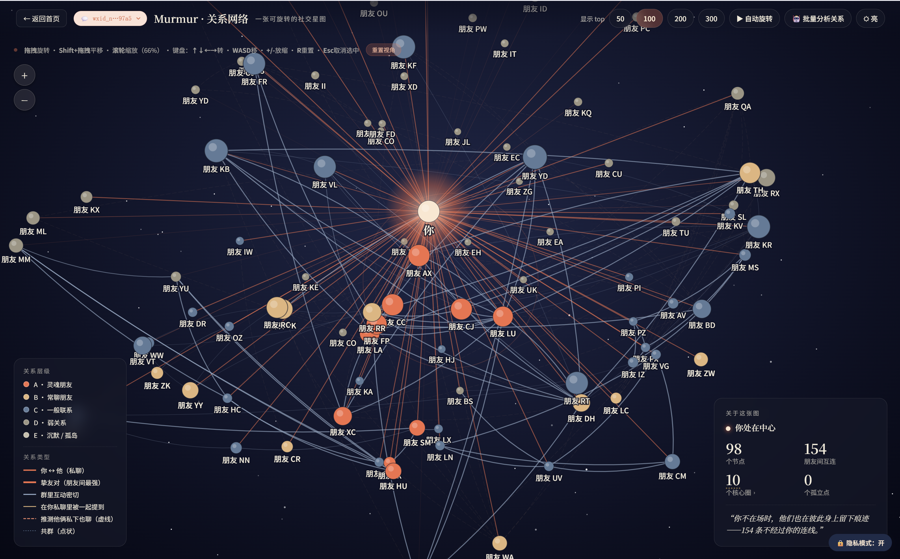
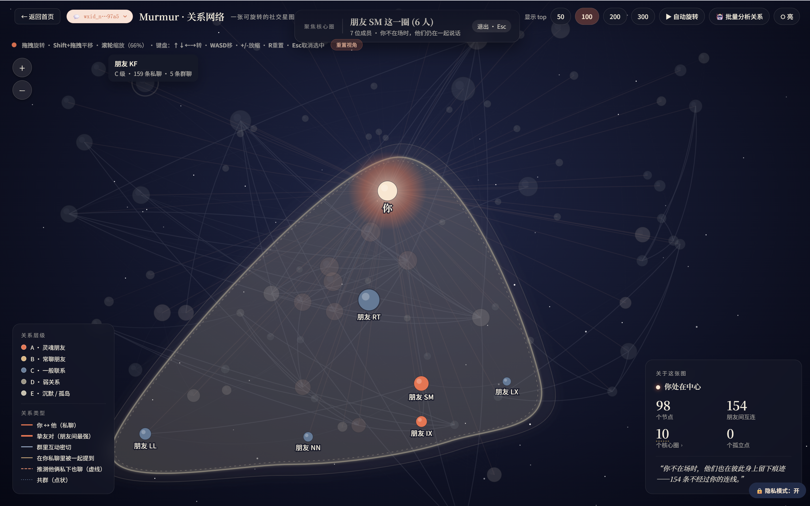
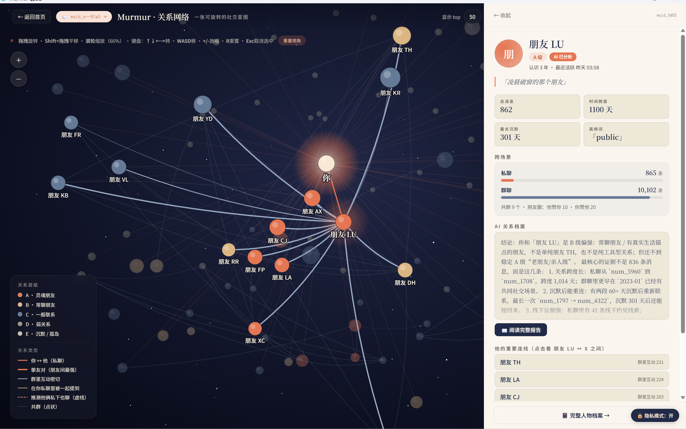
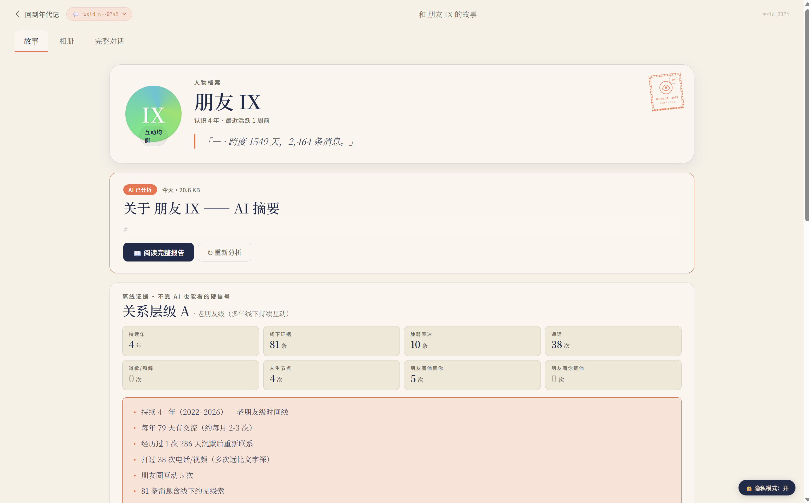
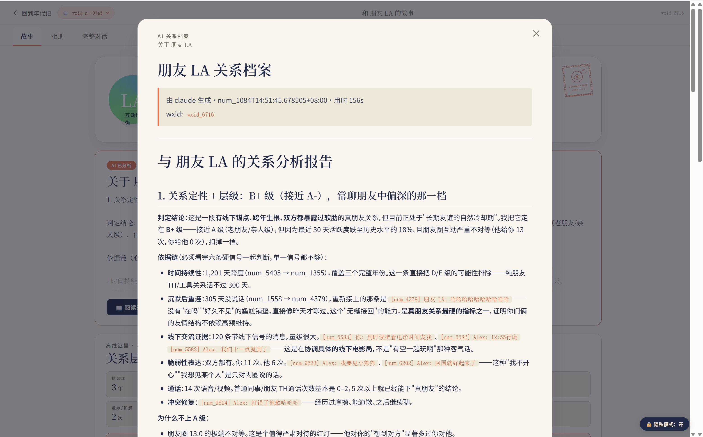

# Murmur 微语

把多年微信和 QQ 聊天 + 朋友圈，在你电脑上做成一张可以**旋转、缩放、聚焦**的 3D 关系网，再让本地的 Claude / Codex 给每个朋友写一份关系档案。

100% 本地分析，不上云。Windows 内置 QQ NT 解密。

[下载最新版](https://github.com/sgaofen/murmur/releases/latest)

当前推荐版本：`v0.4.1`



## v0.4.0 新增

- **年度总览** — 跨所有朋友的「Spotify Wrapped」：Top 5、月度冠军、最忙的一天、最长连续聊天、24×7 热力图、深夜之王、最对等的关系、谁先开聊、口头禅、走丢的人。Home 顶栏 📅 进入。
- **双人关系档案导出** — Murmur 独有：导出朋友 A 与朋友 B 之间的完整关系（共群对话 + 朋友圈互动 + 你私聊里互相提及 + 各自和你的对话样本），三种格式（MD/JSON/HTML）。Friend 页关联朋友卡片每条朋友右侧 📤 一键。
- **AI 助手抽屉** — 替换原来三步弹窗。左侧抽屉滑入选 AI / 范围 / 侧重，本机 AI 跑完直接进两栏读报视图。报告顶部一行「硬证据指纹」（最长连聊 / 你主导 % / 深夜偏向 / 全年趋势）让 AI 引用真数字。
- **微信 4.x 完整文本恢复** — 修复 4.x 把文本塞进 `compress_content` 列导致 Murmur 看到空白的问题，引用 / 链接 / 转账 / 红包 / 文件等 type 49 现在能渲染真实内容。
- **WAL 实时合并** — 解密时把 WAL 里没 checkpoint 的最新消息也补进来，不再卡在「上次微信关之前」。
- **增量解密缓存** — 第二次 refresh 大部分 DB 秒过（mtime 没变 + key 没变就跳过），10GB 历史的用户从分钟级降到秒级。
- **解密前阻断** — 微信还在运行时拒绝解密 + 中文友好提示，避免拿到半页损坏 DB。
- **原子 swap** — 解密产物先写 `*.tmp` 再 `os.replace` 落地，Ctrl-C 不再留半截 DB。

## 它能做什么

- **3D 关系网**：自己在中心，朋友按亲密度散布周围。同一个核心圈的人会落在同一片区域，球面整体保留壮观的星空感。
- **核心圈聚焦**：右下角点「N 个核心圈」→ 列表里选一个 → **半透明 3D 包络**贴合包裹该圈成员，圈外的人和连线全部变暗。
- **点人看档案**：点任意节点 → 右侧弹出关系详情。私聊 / 群聊 / 朋友圈互动，每年沟通频率，有没有沉默后重连，全是离线就能算的硬证据。
- **AI 关系报告**：让本机的 Claude Code 或 Codex CLI 给每个朋友、每对朋友写一份关系分析。Murmur 把脱敏样本和 prompt 整理好喂给 CLI，不上云。
- **双人关系档案**：分析你认识的两个人之间的关系（市面工具只能看你和某人）。
- **年度总览**：所有朋友所有聊天的 Wrapped 风格回顾。
- **隐私模式**：右下一键切，所有真名变「朋友 XX」「群 1」，wxid 和本机路径都隐藏。
- **QQ NT 支持**：Windows 版顶栏可以加 QQ 账号，独立解密 + 独立分析。

## 关系网视觉


**核心圈聚焦**



**点人看关系**



## 单人档案页

每位朋友有独立档案：人物介绍、AI 摘要、离线证据、关联朋友、相册、整对话浏览、双人年代记。关系层级（A 老朋友 / B 常聊 / C 有联系 / D 弱联系 / E 已疏远）由本地算法基于持续年限、电话次数、朋友圈互动等离线证据自动判定。



## AI 关系档案

Murmur 把每个朋友的样本消息 + 离线证据 + 数据指纹（最长连聊、谁主导、深夜比例、年度趋势）+ 评估准则打包，让本机 Claude Code 或 Codex 出一份长文分析。报告里会评估关系定性、列时间持续性、沉默后重连、表达密度等具体证据。



报告默认存到：

```text
~/Desktop/Murmur/agent_reports/
```

## 下载哪个文件

Windows 用户：

- 推荐：`Murmur_0.4.1_x64-setup.exe`
- 备用：`Murmur_0.4.1_x64_en-US.msi`

Mac 用户：

- Apple Silicon：`Murmur_macOS_AppleSilicon.dmg`
- 备用：`Murmur_macOS_AppleSilicon.app.zip`
- **只支持腾讯官网版 WeChat for Mac**。Mac App Store 版 WeChat 目前不支持自动抓密钥；请先换成腾讯官网版再走 Murmur 引导。

Intel Mac 暂时没有安装包，需要从源码运行。

## 视频教程

- [Windows 微信安装视频](https://github.com/sgaofen/murmur/releases/download/v0.4.1/Murmur_Windows_install_tutorial.mp4)
- [Windows QQ 安装视频](https://github.com/sgaofen/murmur/releases/download/v0.4.1/Murmur_QQ_install_tutorial.mp4)
- [Mac 安装视频](https://github.com/sgaofen/murmur/releases/download/v0.4.1/Murmur_macOS_install_tutorial.mp4)

## Windows 安装（微信）

1. 双击 `Murmur_0.4.1_x64-setup.exe`，按引导装。
2. 打开微信，**退出登录回到登录页，但不要关闭微信进程**。
3. 打开 Murmur，点「开始抓密钥」。
4. 看到等待提示后，回微信扫码登录一次。
5. 抓到 key → 自动解密 → 进入关系网。

如果杀毒软件拦截 `wx_key.dll`：把 Murmur 安装目录加白名单后重新安装。

## Windows 安装（QQ）

走完微信流程后，顶栏点「+ 添加新账号 → 🐧 QQ」（或 Welcome 页底部「🐧 切换到 QQ」）。具体见 QQ 安装视频。

## Mac 安装

1. 双击 `Murmur_macOS_AppleSilicon.dmg`。
2. 把 `Murmur.app` 拖到「应用程序」。
3. **不要直接在 dmg 窗口里运行**，要从「应用程序」打开。
4. 第一次打开如果被 Gatekeeper 拦：「系统设置 → 隐私与安全性」滚到底部点「仍要打开」。

Mac 微信要求：请使用 **腾讯官网版 WeChat for Mac**。App Store 版 WeChat 的程序结构和权限保护不同，Murmur 当前不支持它的自动重签名 / 自动抓密钥流程。

如果完全没有「仍要打开」按钮，开 Terminal：

```bash
xattr -dr com.apple.quarantine /Applications/Murmur.app
open /Applications/Murmur.app
```

首次使用时 Murmur 会引导你完成「磁盘访问 → 重签名 → 抓密钥 → 解密」。

## 年度总览

Home 顶栏点 📅 进入。第一次打开会扫所有聊天历史 10-30 秒（之后缓存 24 小时）。包含：

- Top 5 最常聊的朋友
- 12 个月度冠军（每月聊得最多的人）
- 最忙的一天 + 那天主要在和谁聊
- 最长连续聊天天数
- 24×7 热力图
- 深夜之王（23-4 点对话最多）
- 最对等的关系（一来一回最平衡）
- 谁先开聊（按 6h 间隔切对话窗）
- 你的口头禅 top 10
- 走丢的人（前后半年掉幅最大）

## 双人关系档案

任意朋友页 → 关联朋友卡片 → 每个朋友右侧 📤 → 弹出三格式下载（MD / JSON / HTML）。

也可以从 3D 关系网里点两人之间的连线 → pair drawer 里下。

包含的证据：

- 你私聊里提到对方的样例（双向）
- 你和 A / 你和 B 各自的对话样本
- 共同群里 A↔B 的真实对话窗口
- 朋友圈互动（A 给 B 点赞评论数 + 原文）
- 适合直接拖给 ChatGPT / Claude / 豆包 / Kimi 在线 AI 让它推断关系

## AI 分析使用（批量）

报告页（顶部）选：

- 小样本自检（先验证几个人）
- Top 朋友 + Top 关系
- 全部朋友 + 朋友间关系
- 只补朋友间关系报告

并行数和引擎（Claude / Codex / 双跑）可以在面板里设。

## 隐私模式

右下角「🔓 隐私模式：关 / 🔒 隐私模式：开」一键切。开启后会隐藏：

- 朋友昵称、群名（变「朋友 XX」「群 N」）
- wxid、chatroom id
- 本机路径
- 邮箱、手机号样式文本
- 64 位 hex key 字符串
- 身份证号 / 银行卡号样式
- 引用文本里的人名（启发式）

录视频 / 公开截图前点一下，不用反复手动打码。

## 遇到问题

`~/Documents/Murmur/logs/` 下有 `serve.log` 和 `tauri-shell.log`，涵盖后端启动 / 解密失败 / 抓 key 失败的细节。

任何「出了点小问题」屏幕上都有 **「📋 复制诊断信息（粘到 issue）」** 按钮，会自动打包脱敏的版本号 / 平台 / profiles / init_error / 日志末尾，直接粘到 [GitHub issue](https://github.com/sgaofen/murmur/issues/new) 即可。

如果解密报「encrypted database is malformed」之类的，多半是微信升级了 schema：

```bash
python cli/refresh.py --force
```

会清空旧解密目录重新解。

## 隐私 / 数据流向

- 所有解密、分析、可视化 **100% 本地**，无任何网络上传
- AI 报告由你本机已登录的 Claude Code / Codex CLI 生成（这俩 CLI 自己会调云，但 Murmur 把样本脱敏后才喂给它们）
- 抓密钥仅在初始化时一次，之后不再 attach 微信 / QQ 进程
- 解密数据放在 `~/Documents/Murmur/decrypted/`，可随时手动删除
- 双人导出包同样 100% 本地生成
